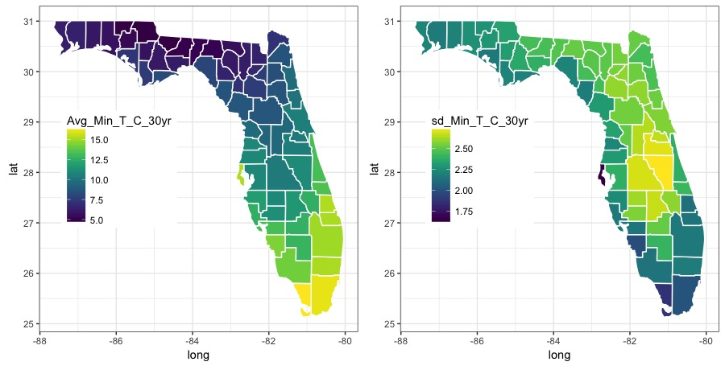

README
================

Analysis of Temperature Datasets
--------------------------------

Objective of this repository is to explore spatial and temporal extent of temperature data, and to develop data science techniques to integrate environmental data into ecological studies.

### Sources

-   [CDC WONDER: Daily Air Temperatures and Heat Index](http://wonder.cdc.gov/nasa-nldas.html)
-   [API access](https://wonder.cdc.gov/wonder/help/WONDER-API.html) to CDC WONDER database
-   [helpful link](http://techqa.info/programming/question/39857253/)

### Packages used in this study

-   `rnoaa` Link to [NOAA R package](https://ropensci.org/blog/2014/03/13/rnoaa/)
-   [github repository](https://github.com/ropensci/rnoaa) for `rnoaa`
-   `wondr` tool for working with CDC WONDER API in R
-   [github repository](https://github.com/hrbrmstr/wondr) for `wondr`
-   `maps` `dplyr` `magrittr`

### Prerequisites

-   You need a [web servies token](https://www.ncdc.noaa.gov/cdo-web/token) from NOAA in order to access bulk data

### Map result 
#### January Minimum Temperature  

#### January Maximum Temperature 

